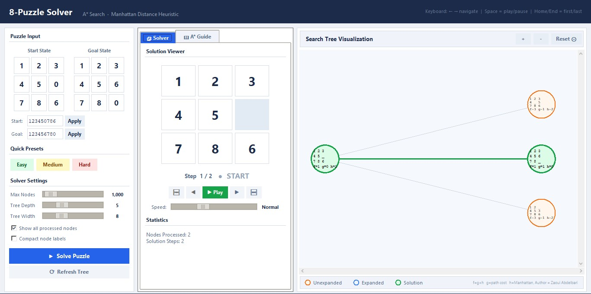

# 🧩 8-Puzzle Solver

A modern desktop application that solves the classic **8-puzzle (jeu du taquin)** using the **A\* search algorithm** with the **Manhattan distance heuristic**. Features a real-time search tree visualization and a built-in A\* algorithm guide.

---

## 📸 Features

| Feature | Description |
|---|---|
| 🔍 **A\* Solver** | Optimal solution guaranteed with Manhattan heuristic |
| 🌳 **Tree Visualization** | Live search tree with zoom, pan, and tooltips |
| 🧭 **Step Navigator** | Play, pause, step through the solution |
| 📖 **A\* Guide** | Built-in interactive explanation of the algorithm |
| 🎯 **Presets** | Easy / Medium / Hard puzzles ready to solve |
| ⌨️ **Keyboard Shortcuts** | Arrow keys, Space, Home/End |

---

## 🚀 Quick Start

### Requirements

- Python 3.8 or higher
- Tkinter (included with standard Python on Windows and macOS)

```bash
# Linux — install Tkinter if missing
sudo apt-get install python3-tk

# macOS — usually bundled with Python
# Windows — bundled with Python installer
```

### Installation

Ensure you have the required libraries installed:

```bash
pip install -r requirements.txt
```

### Run

```bash
python 8_puzzle.py
```

---

## 🖥️ Interface Overview

```
┌─────────────────────────────────────────────────────────────────┐
│  HEADER  — title · algorithm name · keyboard hint               │
├──────────────┬──────────────────────┬───────────────────────────┤
│  LEFT PANEL  │  CENTER PANEL        │  RIGHT PANEL              │
│              │  ┌────────────────┐  │                           │
│ Puzzle Input │  │ 🧩 Solver tab  │  │  Search Tree Canvas       │
│ Quick Pres.  │  │  · Tile board  │  │  (zoom · pan · tooltips)  │
│ Settings     │  │  · Navigation  │  │                           │
│ Solve btn    │  ├────────────────┤  │  Legend bar               │
│              │  │ 📖 A* Guide tab│  │                           │
│              │  │  · Explanation │  │                           │
│              │  └────────────────┘  │                           │
├──────────────┴──────────────────────┴───────────────────────────┤
│  STATUS BAR — live feedback                                      │
└─────────────────────────────────────────────────────────────────┘
```
>

### Left Panel — Controls

- **Puzzle Input** — enter start and goal states via 3×3 grid tiles or a 9-digit string (e.g. `123456780`)
- **Quick Presets** — load Easy (2 steps), Medium (3 steps), or Hard (15 steps) puzzles instantly
- **Solver Settings** — sliders for Max Nodes (100–20 000), Tree Depth, Tree Width
  - *Show all processed nodes* — display every explored state in the tree
  - *Compact node labels* — switch to single-line node text
- **Solve / Refresh** — run A\* or redraw the tree with new display settings

### Center Panel — Two Tabs

**🧩 Solver tab**

- Large tile board showing the current solution step
- Highlighted moved tile (amber) and directional arrow (colored by direction)
- Navigation: ⏮ First · ◀ Prev · ▶ Play · ▶ Next · ⏭ Last
- Auto-play with speed slider (Fast / Normal / Slow)
- Statistics: nodes processed and solution step count

**📖 A\* Guide tab**

A scrollable, illustrated explanation covering:
1. The 8-Puzzle problem definition
2. State space as a graph
3. The A\* cost function: `f(n) = g(n) + h(n)`
4. Step-by-step algorithm walkthrough
5. Manhattan distance heuristic with formula and example
6. Optimality and completeness properties
7. How to read the search tree
8. Puzzle solvability check (inversion counting)

### Right Panel — Search Tree

- Every explored board state shown as a labeled node
- **Hover** any node for a tooltip with full state, f/g/h values, and expansion status
- Zoom: `＋` / `－` buttons or mouse scroll wheel
- Pan: click and drag
- Reset view: `⊙ Reset` button

---

## ⌨️ Keyboard Shortcuts

| Key | Action |
|---|---|
| `→` Right Arrow | Next step |
| `←` Left Arrow | Previous step |
| `Home` | First step |
| `End` | Last step |
| `Space` | Play / Pause auto-play |

---

## 🔬 How A\* Works

A\* is a **best-first search** algorithm that finds the shortest path from a start state to a goal state in a weighted graph.

### The Core Formula

```
f(n) = g(n) + h(n)
```

| Symbol | Meaning |
|---|---|
| `f(n)` | Estimated total cost of the best path through node `n` |
| `g(n)` | Actual cost from the Start to node `n` (exact) |
| `h(n)` | Estimated cost from `n` to the Goal (heuristic) |

A\* always expands the node with the **lowest `f` value** from its priority queue (Open list).

### Manhattan Distance Heuristic

For each tile, the Manhattan distance is the sum of horizontal and vertical distances from its current position to its goal position:

```
h(n) = Σ ( |row_i - goal_row_i| + |col_i - goal_col_i| )
         for all tiles except the blank
```

This heuristic is **admissible** — it never over-estimates the true cost — which guarantees that A\* finds the optimal (shortest) solution.

### Algorithm Steps

1. **Initialise** — push Start onto Open with `f = h(Start)`
2. **Pick best** — pop the node with lowest `f` from Open
   - If it is the Goal → reconstruct and return the path
3. **Expand** — generate all valid tile-slide successors
   - For each: `g_new = g_parent + 1`, `h_new = Manhattan(successor)`
4. **Update Open** — add successor if new or found via cheaper path; skip Closed nodes
5. **Repeat** from step 2 until Goal found or Open is empty (no solution)

### Properties

| Property | Value |
|---|---|
| **Optimal** | ✅ Yes — with admissible heuristic |
| **Complete** | ✅ Yes — finds solution if one exists |
| **Time complexity** | Exponential in worst case; fast in practice for 8-puzzle |
| **Space complexity** | Stores all Open list nodes in memory |

### Comparison with Other Algorithms

| Algorithm | Optimal? | Fast? | Notes |
|---|---|---|---|
| **A\*** | ✅ Yes | ✅ Yes | Uses both g and h — best balance |
| **Greedy** | ❌ No | ✅ Very fast | Uses only h — can find suboptimal paths |
| **BFS** | ✅ Yes | ❌ Slow | Ignores h — explores too many nodes |
| **DFS** | ❌ No | ❌ Very slow | May loop infinitely on the taquin |
| **ID-DFS** | ✅ Yes | ⚠️ Slow for large puzzles | Iterative depth-first with admissible start |

---

## 🔢 Puzzle Solvability

Not every arrangement of the 8 tiles can reach the goal. A configuration is **solvable if and only if the number of inversions is even**.

An **inversion** is any pair of tiles `(i, j)` where `i` appears before `j` in reading order (left-to-right, top-to-bottom), but `i > j` (ignoring the blank tile).

```
inversions = count of pairs (i, j) where  i < j  but  tile[i] > tile[j]

Solvable  ⟺  inversions is EVEN
```

> **Note:** The original project's Hard preset (`283164705`) had an odd number of inversions (unsolvable). This has been corrected — the included Hard preset (`813402765`) is solvable in 15 optimal steps.

---

## 🗂️ Project Structure

```
8_puzzle.py          # Main application (single file)
requirements.txt     # Required libraries
README.md            # This file
```

### Code Structure

```
Puzzle                   # Core algorithm class
  ├── is_goal()
  ├── get_successors()
  ├── manhattan_distance()
  └── solve()            # A* implementation

TreeVisualization        # Canvas-based tree renderer
  ├── draw_tree()
  ├── _calc_positions()
  ├── _show_tip()        # Hover tooltips
  └── clear()

PuzzleGUI                # Main application window
  ├── _make_header()
  ├── _make_left()       # Input · Presets · Settings · Actions
  ├── _make_center()     # Solver tab + A* Guide tab
  ├── _make_right()      # Tree canvas
  └── _make_statusbar()
```

---

## 📐 Preset Configurations

| Preset | Start State | Steps | Nodes |
|---|---|---|---|
| Easy | `1 2 3 / 4 5 _ / 7 8 6` | 2 | 2 |
| Medium | `1 2 3 / 4 _ 6 / 7 5 8` | 3 | 3 |
| Hard | `8 1 3 / 4 _ 2 / 7 6 5` | 15 | 77 |

Goal state for all presets: `1 2 3 / 4 5 6 / 7 8 _`

---

## 📚 References

- Rand Asswad — *Le Jeu du Taquin* — [rand-asswad.xyz/taquin](https://rand-asswad.xyz/taquin/)  
  Original Prolog implementation with A\*, Greedy, and ID-DFS comparison
- Hart, Nilsson, Raphael (1968) — *A Formal Basis for the Heuristic Determination of Minimum Cost Paths*
- Princeton COS226 — [8-Puzzle Programming Assignment](https://www.cs.princeton.edu/courses/archive/spr10/cos226/assignments/8puzzle.html)

---

## 📄 License

MIT — free to use and modify.
don't forget star this repo